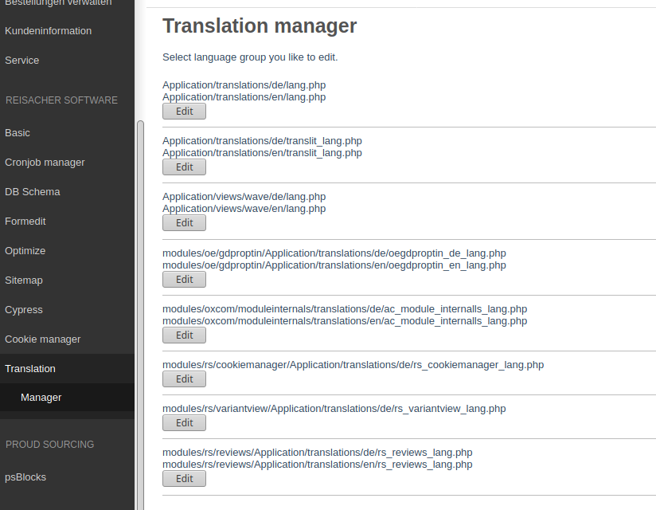
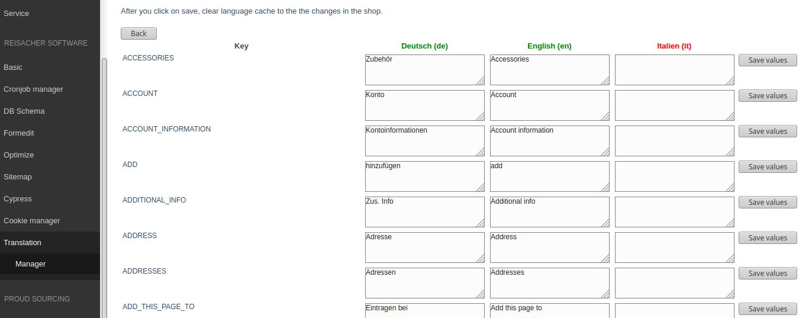

# Oxid translate

## Description

Display all frontend language files and give the oppotunity to modify the values.
After save the values and refresh the language cache, the module override the 
language values in the language file. The value in the language file will not modify.

## Install

1. Copy files into following directory

        source/modules/rs/translate
        
2. Add following to composer.json on the shop root

        "autoload": {
            "psr-4": {
                "rs\\translate\\": "./source/modules/rs/translate"
            }
        },
    
3. Refresh autoloader files with composer.

        composer dump-autoload

4. Execute following SQL statment

        CREATE TABLE `rs_translate` (
         `oxid` char(32) CHARACTER SET latin1 COLLATE latin1_general_ci NOT NULL,
         `rs_file_id` char(32) CHARACTER SET latin1 COLLATE latin1_general_ci DEFAULT NULL,
         `rs_lang_id` int(10) NOT NULL DEFAULT '0',
         `rs_lang_key` varchar(250) DEFAULT NULL,
         `rs_lang_value` varchar(2000) DEFAULT NULL,
         `rs_created` datetime NOT NULL DEFAULT CURRENT_TIMESTAMP,
         `rs_updated` datetime NOT NULL DEFAULT CURRENT_TIMESTAMP ON UPDATE CURRENT_TIMESTAMP,
         PRIMARY KEY (`oxid`),
         KEY `rs_file_id` (`rs_file_id`),
         KEY `rs_lang_id` (`rs_lang_id`),
         KEY `rs_lang_key` (`rs_lang_key`)
        ) ENGINE=InnoDB DEFAULT CHARSET=utf8;
        
5. Enable module in the oxid admin area, Extensions => Modules
    